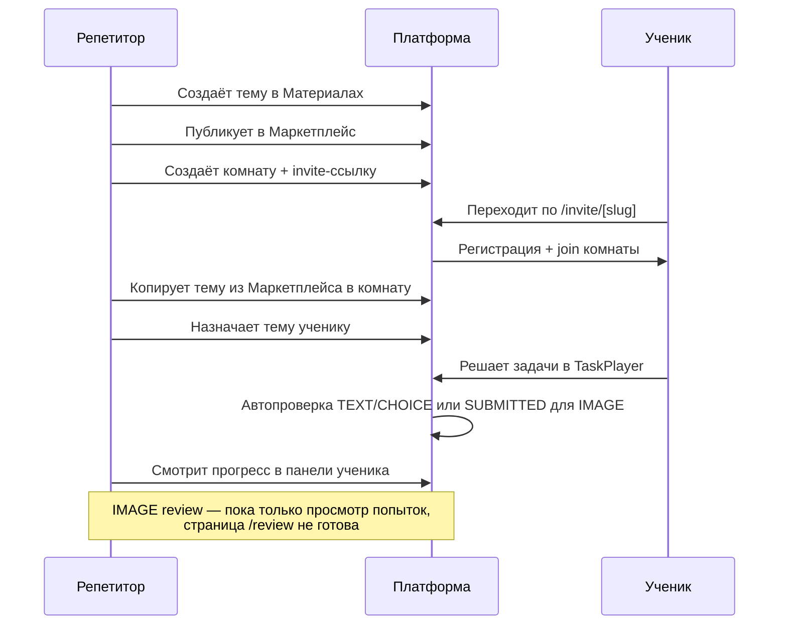

# Система «Долина знаний» — функционал и взаимодействие репетитор ↔ ученик

> Актуально на: **2026-05-24** · прод: [https://diary-ai.ru](https://diary-ai.ru) · commit `cf52d40`

Этот документ описывает **назначение платформы**, **как она работает**, **полный цикл репетитор–ученик** и **текущее состояние** (что готово, что заглушка, что улучшить).

Связанные документы:

| Документ | Содержание |
| -------- | ---------- |
| [PRODUCT.md](PRODUCT.md) | Краткий продуктовый обзор (частично устарел — см. раздел «Расхождения») |
| [ARCHITECTURE.md](ARCHITECTURE.md) | Стек и структура репозитория |
| [ROADMAP.md](ROADMAP.md) | Этапы разработки (отстаёт от кода — см. ниже) |
| [OPS.md](OPS.md) | Сервер, деплой, доступы |
| [E2E-REPORT.md](E2E-REPORT.md) | Автотесты Playwright |

---

## 1. Назначение

**«Долина знаний»** — веб-платформа для репетиторов и их учеников.

Репетитор:

- создаёт **учебные комнаты** и приглашает учеников по ссылке;
- ведёт **банк заданий** (темы с задачами TEXT / CHOICE / IMAGE);
- публикует материалы в **маркетплейс** и берёт чужие;
- **назначает темы** ученикам как домашнюю работу;
- **отслеживает прогресс** — попытки, ошибки, подсказки, пропуски.

Ученик:

- входит по **приглашению** в комнату репетитора;
- видит **назначенные темы** и решает задачи в интерактивном плеере;
- получает **автопроверку** (текст/выбор) или загружает **фото** (IMAGE);
- смотрит **свой прогресс** по комнатам и темам.

---

## 2. Роли

| Роль | Как создаётся | Основные разделы |
| ---- | ------------- | ---------------- |
| **TUTOR** | Регистрация с ролью «Репетитор» | Комнаты, Материалы, Маркетплейс, Проверка*, Ученики* |
| **STUDENT** | Регистрация с ролью «Ученик» или по invite-ссылке | Задания, Домашняя, Комнаты, Прогресс |
| **ADMIN** | В схеме БД, UI пока нет | — |

\* — раздел в навигации есть, но страница пока **заглушка**.

---

## 3. Модель данных (актуальная)

Схема: `prisma/schema.prisma`. Ключевой поток данных:

```
TaskTopic + Task          ← банк репетитора (/dashboard/materials)
    │ isPublished=true
    ▼
Marketplace               ← каталог опубликованных тем
    │ copyTopicToRoom()   ← снимок (immutable)
    ▼
RoomTopic + RoomTask      ← темы внутри комнаты
    │ assignTopicToStudent()
    ▼
StudentTopicAssignment + StudentTaskAssignment
    │ TaskPlayer (ученик решает)
    ▼
StudentTaskProgress + StudentTaskAttempt
```

**Важно:** изменения в банке (`TaskTopic` / `Task`) **не** попадают в уже скопированные `RoomTopic`. Копирование в комнату — только через **маркетплейс** (тема должна быть опубликована).

**Устаревшие сущности** (в БД есть, UI не использует):

- `Assignment` + `Submission` — старая модель «текстовых заданий»;
- `MarketplaceTask` — заменена на `TaskTopic.isPublished`.

---

## 4. Полный цикл: репетитор ↔ ученик

### 4.1. Регистрация и вход

1. Репетитор: `/register` → роль TUTOR → email + OTP (Better Auth, SMTP smtp.bz).
2. Ученик: переходит по `/invite/[slug]` → регистрация с **заблокированной** ролью STUDENT.
3. После входа — **онбординг-модалка** (имя; для репетитора — предметы).
4. Cookie `room_invite_slug` (7 дней) + `POST /api/rooms/join-pending` — автоматическое вступление в комнату.

### 4.2. Репетитор: подготовка материалов

```
Материалы → создать тему → добавить задачи (TEXT / CHOICE / IMAGE)
         → опубликовать в маркетплейс (isPublished)
```

- Конструктор задач: текст, варианты ответа, подсказки, картинки.
- Предпросмотр перед публикацией.

### 4.3. Репетитор: комната и приглашение

```
Комнаты → создать комнату → скопировать invite-ссылку
       → ученик переходит по ссылке и попадает в комнату
```

- В комнате: список учеников, темы комнаты, управление.
- Темы в комнату: **Маркетплейс → «Добавить в комнату»** (свои или чужие опубликованные темы).

### 4.4. Репетитор: назначение домашней работы

```
Комната → Ученики → «Прогресс ученика» → «Назначить тему»
       → выбор RoomTopic и конкретных задач
       → создаётся StudentTopicAssignment
```

- Можно **снять назначение** (inline-подтверждение, без `window.confirm`).
- В панели прогресса: статистика, попытки, ошибки, подсказки.

### 4.5. Ученик: выполнение

```
Домашняя (/dashboard/homework) → выбрать тему → TaskPlayer
```

Поведение по типу задачи:

| Тип | Проверка | Статус после ответа |
| --- | -------- | ------------------- |
| TEXT | Авто (с альтернативными ответами) | CORRECT / ошибка + счётчик |
| CHOICE | Авто | CORRECT / ошибка |
| IMAGE | Загрузка фото | SUBMITTED (ручная проверка **не реализована**) |

Дополнительно: **Подсказка**, **Пропустить**, прогресс-бар по теме.

### 4.6. Мониторинг

| Кто | Где смотрит |
| --- | ----------- |
| Ученик | `/dashboard/progress`, `/dashboard/assignments` (все задачи комнаты + статусы) |
| Репетитор | Панель «Прогресс ученика» в комнате |

---

## 5. Карта разделов (dashboard)

### Репетитор

| URL | Статус | Описание |
| --- | ------ | -------- |
| `/dashboard` | ⚠️ Заглушка | Приветствие + статичные карточки без ссылок и данных |
| `/dashboard/students` | ⚠️ Заглушка | «Раздел появится…»; реальный список — в drawer «Ученики» на странице комнат |
| `/dashboard/rooms` | ✅ | CRUD комнат, drawer учеников |
| `/dashboard/rooms/[id]` | ✅ | Invite, ученики, темы, прогресс, назначение |
| `/dashboard/assignments` | ↪️ Редirect | Перенаправляет на `/dashboard/materials` |
| `/dashboard/review` | ⚠️ Заглушка | Ручная проверка IMAGE-ответов не реализована |
| `/dashboard/marketplace` | ✅ | Каталог тем (импорт legacy ОГЭ), поиск, теги, копирование в комнату |
| `/dashboard/materials` | ✅ | Банк тем и задач |
| `/dashboard/settings` | ✅ | Профиль, выход, удаление аккаунта |

### Ученик

| URL | Статус | Описание |
| --- | ------ | -------- |
| `/dashboard` | ⚠️ Заглушка | Статичные карточки |
| `/dashboard/assignments` | ✅ | Все темы/задачи комнат; кликабельны только назначенные (домашние) |
| `/dashboard/homework` | ✅ | Назначенные темы с прогрессом |
| `/dashboard/homework/[id]` | ✅ | TaskPlayer |
| `/dashboard/rooms` | ✅ | Список комнат |
| `/dashboard/progress` | ✅ | Агрегированная статистика |
| `/dashboard/settings` | ✅ | Профиль, выход |

---

## 6. Инфраструктура (prod)

Проверено **2026-05-24** через SSH (`111.88.118.35`, `/opt/dolinaznaniy`):

| Компонент | Состояние |
| --------- | --------- |
| Docker app | `Up (healthy)`, образ `cf52d40` |
| PostgreSQL 16 | `Up (healthy)` |
| Adminer | `127.0.0.1:8080` (только через SSH-туннель) |
| `/api/health` | `status: ok`, `database: connected` |
| Деплой | push `main` → GitHub Actions → GHCR → сервер |

---

## 7. Результаты Playwright E2E (2026-05-24)

Команда: `E2E_BASE_URL=https://diary-ai.ru npm run test:e2e`

| Результат | Кол-во |
| --------- | ------ |
| ✅ Passed | 10 |
| ⚠️ Flaky | 1 (student login — timeout 45s, retry OK) |
| ⏭ Skipped | 2 (revoke, wrong-answer TEXT) |

**Работает стабильно:** вход репетитора, комнаты, панель прогресса, назначение темы, домашняя ученика, skip, hint, photo upload, progress page.

**Пропущено из-за данных:** revoke (нет назначений для снятия), wrong-answer (текущая задача не TEXT).

---

## 8. Выявленные проблемы

### Критичные / функциональные

| # | Проблема | Влияние |
| - | -------- | ------- |
| 1 | **`/dashboard/review` — заглушка** | IMAGE-ответы уходят в SUBMITTED, репетитор не может принять/отклонить с комментарием |
| 2 | **Нет прямого копирования «Материалы → Комната»** | Обязательная публикация в маркетплейс даже для приватных тем |
| 3 | **Flaky login ученика** | Первый запрос иногда >45s (cold start / `waitUntil: load`) |

### UX / продуктовые

| # | Проблема | Влияние |
| - | -------- | ------- |
| 4 | **Главная `/dashboard` — статичная заглушка** | Карточки не ведут в разделы, нет живой статистики |
| 5 | **`/dashboard/students` — заглушка** | Дублирует drawer на странице комнат; пункт меню вводит в заблуждение |
| 6 | **Пункт «Задания» у репетитора → materials** | Путаница: два пункта («Задания» и «Материалы») ведут в одно место |
| 7 | **Имя ученика = email-префикс** | В UI «marutin8578621» вместо displayName (онбординг пройден?) |
| 8 | **Задачи «Доступно» без назначения** | В `/assignments` видны, но не кликабельны — может сбивать с толку |
| 9 | **Hardcoded RU на `/dashboard`** | Не локализовано (en locale) |

### Технический долг / документация

| # | Проблема |
| - | -------- |
| 10 | `ROADMAP.md` указывает «Этап 2 — Auth», хотя комнаты, homework и marketplace уже в prod |
| 11 | `PRODUCT.md` / `ARCHITECTURE.md` описывают старую модель Assignment/Submission |
| 12 | Мёртвый код: `Assignment`, `Submission`, `MarketplaceTask`, actions в `rooms/actions.ts` |
| 13 | Нет E2E сценария «назначить → решить → репетитор видит результат» end-to-end |

---

## 9. Предложения по улучшению

### Приоритет 1 — закрыть пробелы в основном цикле

1. **Страница проверки IMAGE** (`/dashboard/review`): очередь SUBMITTED, просмотр фото, accept/reject + комментарий.
2. **Копирование темы в комнату из «Материалов»** без обязательной публикации (флаг «только для своих комнат»).
3. **Живая главная dashboard**: счётчики (ученики, комнаты, на проверке), быстрые ссылки.

### Приоритет 2 — UX и стабильность

4. Реализовать **`/dashboard/students`** или убрать из nav и перенаправить в комнаты.
5. Переименовать nav репетитора: убрать дублирующий «Задания» или заменить на «Материалы».
6. Исправить flaky login: `waitUntil: 'domcontentloaded'`, retry в globalSetup.
7. i18n для dashboard home и оставшихся hardcoded строк.

### Приоритет 3 — качество и поддержка

8. Обновить **ROADMAP**, **PRODUCT**, **ARCHITECTURE** под текущую модель данных.
9. Удалить legacy `Assignment`/`Submission`/`MarketplaceTask` или пометить deprecated + migration plan.
10. E2E: полный flow assign → solve TEXT wrong→correct → tutor stats; seed/fixture для revoke.
11. Уведомления ученику о новом назначении (email/push — позже).

---

## 10. Диаграмма взаимодействия



---

## 11. Расхождения документации (TODO для docs)

| Документ | Что устарело | Что актуально |
| -------- | ------------ | ------------- |
| ROADMAP | «Этап 2 Auth текущий» | Auth ✅, Rooms ✅, Homework ✅, Marketplace ✅ |
| PRODUCT | Assignment → Submission | TaskTopic → RoomTopic → StudentTopicAssignment |
| ARCHITECTURE | MarketplaceTask | TaskTopic.isPublished |
| dashboard/page.tsx | «появится после этапа комнат» | Комнаты уже работают |

**Рекомендация:** после согласования обновить ROADMAP (этапы 2–5 → done/partial) и PRODUCT.md (новая модель данных).

---

## 12. Тестовые аккаунты (E2E)

Используются в `e2e/helpers/auth.ts` и Playwright globalSetup:

- **Репетитор:** `marutin8578621@yandex.ru`
- **Ученик:** `marutin8578621@gmail.com`
- **Тестовая комната ID:** `cmphbybup0001ph01iwy4hj3e`

Запуск тестов:

```bash
E2E_BASE_URL=https://diary-ai.ru npm run test:e2e
```
